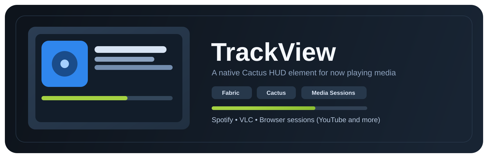
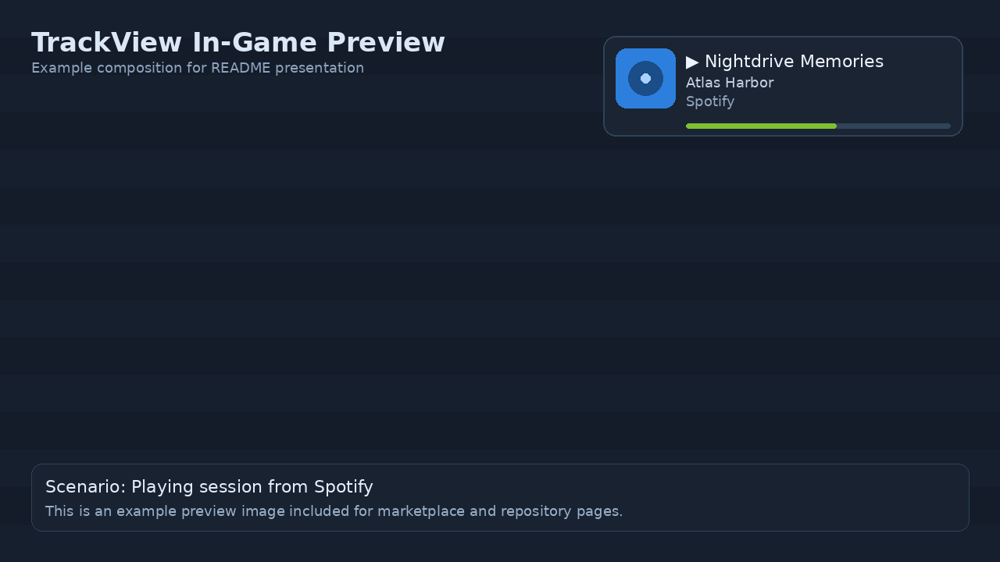
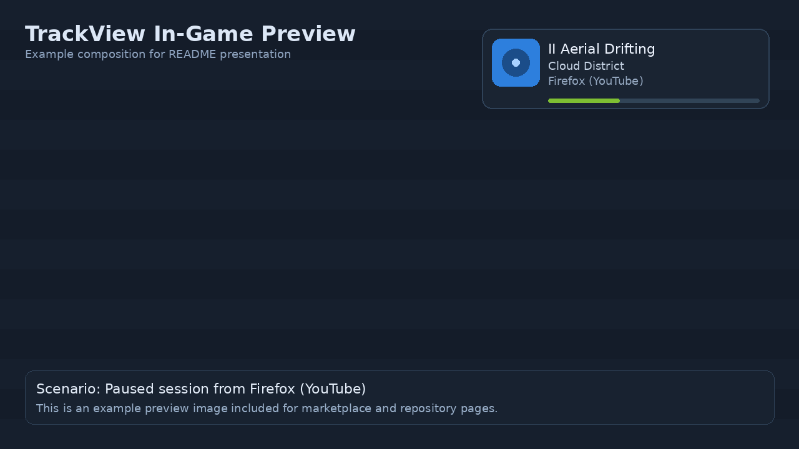
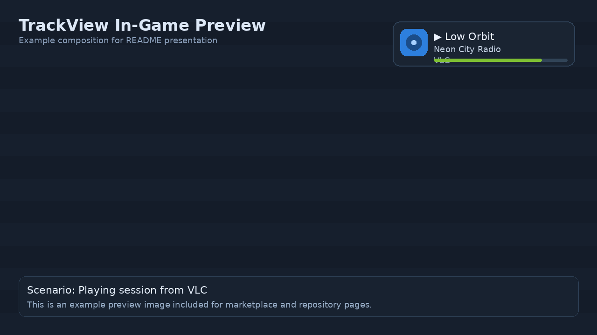

# TrackView

TrackView is a Cactus addon for Fabric that adds a polished `Now Playing` HUD element.

It reads active system media sessions (for example Spotify, VLC, and browser media sessions like YouTube when exposed by the OS media API) and displays track metadata directly in-game.

## Features

- Native Cactus HUD element (`Track View`)
- Album art / thumbnail rendering with async loading and cache
- Title, artist, source app, playback state indicator
- Optional progress bar
- HUD editor resize support
- Runtime settings for compact mode, image size, and visibility behavior

## Compatibility

- Minecraft: `1.21.11`
- Loader: `Fabric`
- Java: `21`
- Required mod: `Cactus 0.12.3+`

## In-Game Preview

### Preview 1 - Default Layout

### Preview 2 - Browser Session

### Preview 3 - Compact Layout

## HUD Settings

- `Show Thumbnail`
- `Image Size`
- `Show Source App`
- `Show Progress Bar`
- `Hide Without Media`
- `Compact Mode`

## Installation

1. Install Fabric Loader for Minecraft `1.21.11`.
2. Install Cactus (`0.12.3` or newer).
3. Place `trackview-<version>.jar` into your `mods` folder.
4. Start the game and add the `Track View` element in the Cactus HUD editor.

## Notes

- TrackView only displays media sessions exposed by the operating system's media session interface.
- Some players or browser tabs may not provide artwork or full metadata.
- No cheats, hacks, or gameplay advantage features are included.

## Legal

TrackView is an independent addon and is not affiliated with Mojang, Modrinth, Spotify, VLC, YouTube, or Cactus.

All third-party names and trademarks belong to their respective owners.

## License

This project is licensed under the terms of the `LICENSE` file in this repository.
