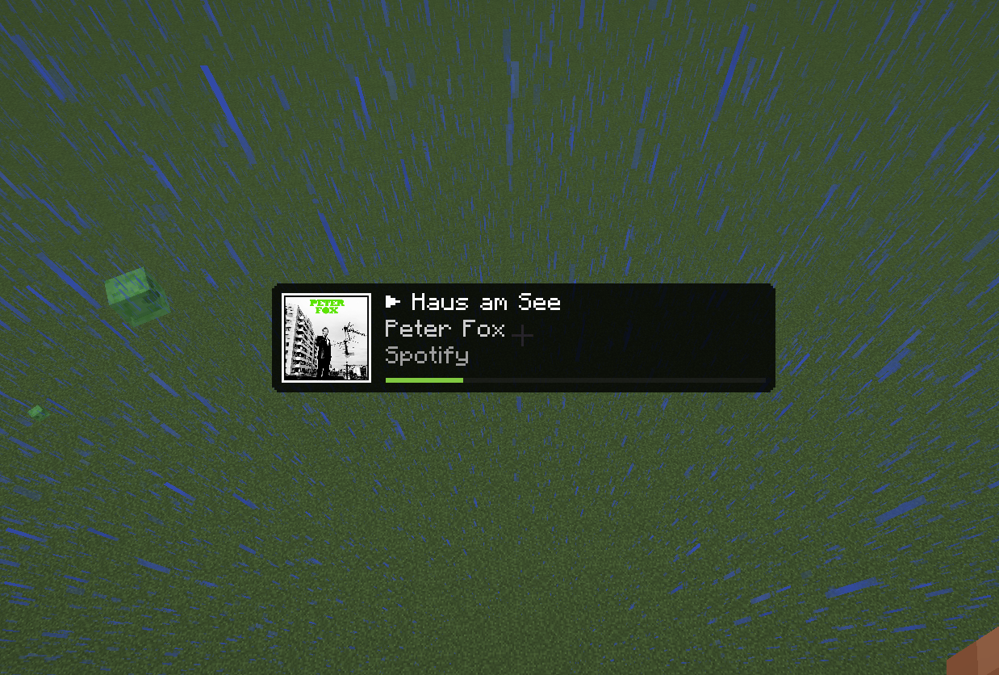
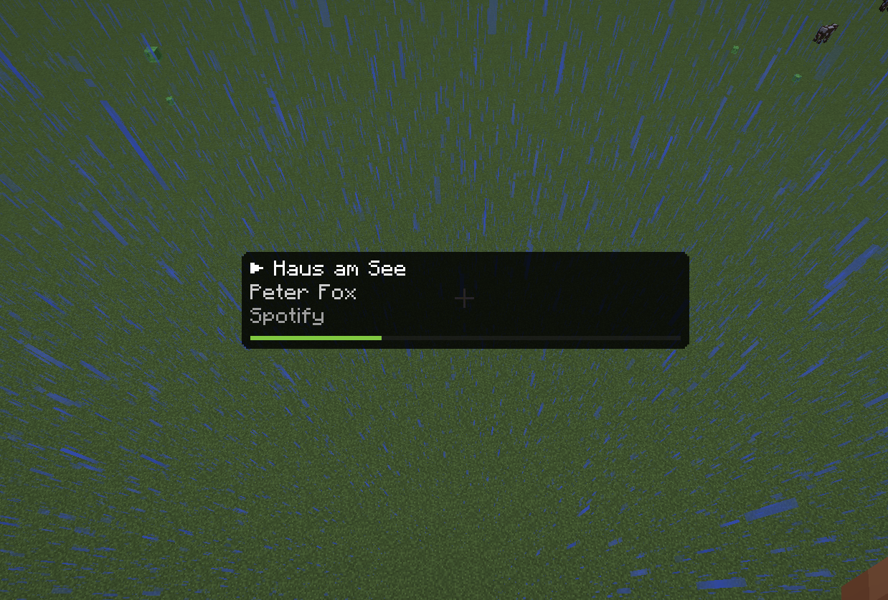
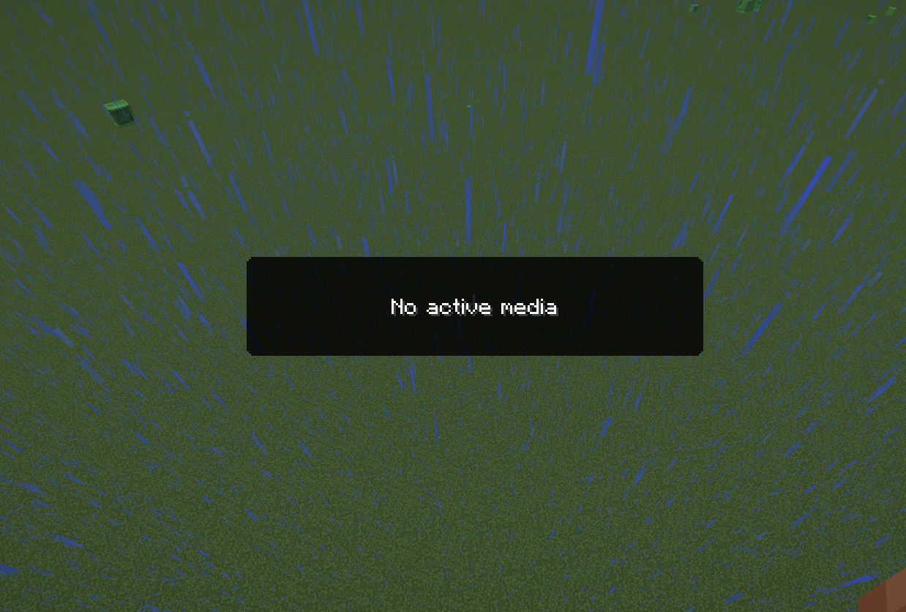

# TrackView

TrackView is a polished Cactus addon that adds a clean **Now Playing HUD** for system media sessions (Spotify, browser media sessions, and other providers exposed by your OS).

## Highlights

- Native-feeling Cactus HUD element (`Track View`)
- Album art / thumbnail rendering with async decoding and caching
- Title, artist, source app, and playback state indicator
- Optional progress bar when duration + position are available
- Resizable element with adjustable image size
- Fallback behavior when no media session is active

## In-Game Preview

### Standard Layout

### No-Thumbnail

### No-Media / Fallback State

## Requirements

- Minecraft
- Fabric Loader
- Java
- Cactus 

## Installation

1. Install Fabric Loader and Cactus.
2. Download the latest TrackView `.jar` from your release page.
3. Put the file into your `mods` folder.
4. Launch the game and add **Track View** in the Cactus HUD editor.

## Configuration

The `Track View` element includes:

- `Show Thumbnail`
- `Image Size`
- `Show Source App`
- `Show Progress Bar`
- `Hide Without Media`
- `Compact Mode`

## Notes

- Media availability depends on your OS media-session integration and active players.
- Some browser tabs or players may not expose artwork or full metadata.

## Legal

TrackView is an independent addon and is **not affiliated with Modrinth, Mojang, or Microsoft**.
