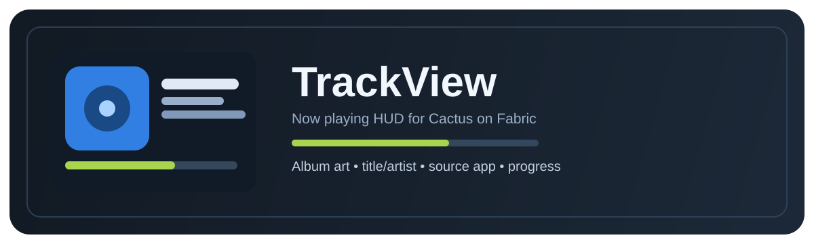

# TrackView

TrackView is a Cactus addon for Fabric that adds a clean and readable now-playing HUD element.

It displays active system media session data in-game, including title, artist, app source, playback state, optional progress bar, and cover art when available.

## Why install TrackView?

- Looks and behaves like a native Cactus HUD element
- Lightweight and async (no render-thread network blocking)
- Works with system media sessions (Spotify, VLC, browser sessions, and more)
- Easy to configure in the Cactus HUD editor

## Main Features

- Cover art / thumbnail
- Track title and artist
- Source app label
- Playback state indicator
- Optional progress bar
- Resize support in the Cactus HUD editor

## Configuration

- Show Thumbnail
- Image Size
- Show Source App
- Show Progress Bar
- Hide Without Media
- Compact Mode

## Requirements

- Minecraft `1.21.11`
- Fabric Loader
- Java `21`
- Cactus `0.12.3+`

## Setup

1. Install Fabric Loader and Cactus.
2. Put the TrackView JAR in your `mods` folder.
3. Launch Minecraft.
4. Open Cactus HUD editor and add `Track View`.

## Gallery (Example Previews)

## Important Notes

- TrackView does not include cheats, hacks, x-ray, aim assist, movement exploits, or server bypass functionality.
- TrackView does not upload gameplay data to external servers.
- Displayed metadata depends on what your OS media session API exposes.

## Trademark / Affiliation Notice

TrackView is not affiliated with Modrinth, Mojang, Spotify, VLC, YouTube, or Cactus.

All trademarks and product names are property of their respective owners.
